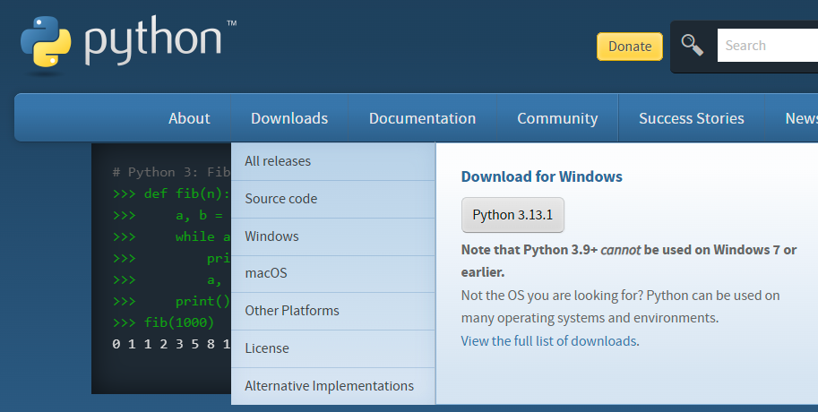

# KakaoTalk-Chat-Log-Analyzer
이 문서는 대화내용 내보내기로 떨어진 txt를 사용자 입맛에 맞게 분석하는 파이썬 스크립트입니다.</br>
오픈채팅방 관리자분이 수작업으로 하나씩 체크하고 계시실레 만들었습니다.</br>
이 스크립트는 chatgpt를 사용하여 매우 간단하게 만든 스크립트입니다.</br>

---

## 목표 기능
- 대화내용 내보내기를 통해 떨어진 txt를 읽어들입니다.
- 읽은 txt 에서 지난 N일간 대화 참석 비율, 가장 최근 대화 일자 정보를 뽑아냅니다.
- 채팅방 참여율 순위를 작성합니다.

## 사전 준비

다음 소프트웨어가 시스템에 설치되어 있는지 확인하세요:

1. **Python** (버전 3.7 이상)
   - [python.org](https://www.python.org/)에서 Python을 다운로드하고 설치합니다.
2. **Pip** (Python 패키지 관리자)
   - Pip은 일반적으로 Python 설치 시 포함되어 있습니다.

---

## 설정 방법

1. **스크립트 다운로드 또는 복사**
   - 스크립트를 다운로드 받습니다.</br>
    
2. **필요한 라이브러리 설치**
   - 터미널이나 명령 프롬프트를 엽니다.
   - 스크립트가 있는 디렉토리로 이동합니다.
   - 아래 명령어를 실행하여 필요한 라이브러리를 설치합니다:
     ```bash
     pip install -r requirements.txt
     ```
     *(참고: 필요한 경우 아래 내용을 포함한 `requirements.txt` 파일을 생성하세요)*
     ```
     argparse
     ```

3. **채팅 로그 파일 준비**
   - 카카오톡 대화 내용을 `.txt` 파일로 내보냅니다.
    1. pc 카톡을 실행합니다.
    2. 대화내용을 저장하고 싶은 채팅방에서 우측상단 메뉴[≡] 버튼을 눌러 사이드 메뉴를 열어주세요.
    3. 우측 하단 설정(톱니바퀴 모양의 아이콘 이미지)버튼을 누른 후 '대화 내용 내보내기'를 선택합니다.
    4. 이 때,  '텍스트만 보내기' 또는 '모든 메시지 내부저장소에 저장'을 선택하시면 대화내용을 이메일로 전송하거나 휴대폰에 저장하실 수 있습니다. 
   - 내보낸 파일을 스크립트에서 접근 가능한 디렉토리에 저장합니다.

---

## 사용 방법

다음 명령어를 사용하여 스크립트를 실행하세요:

```bash
python ChatAnalysis.py --file <채팅 파일 경로>
```

### 옵션

- `--file`: 분석할 카카오톡 대화 파일 경로를 지정합니다 (필수).
- `--debug`: 디버그 모드를 활성화하여 상세 로그 메시지를 확인합니다 (선택).

### 예시

```bash
python ChatAnalysis.py --file ./example_chat.txt --debug
```

---

## 스크립트 워크플로우

1. **파일 입력**: `--file` 옵션으로 지정한 카카오톡 대화 파일을 읽습니다.
2. **저장 날짜 추출**: 파일에서 저장 날짜를 추출합니다.
3. **채팅 파싱**: 사용자, 시간, 메시지를 파악합니다.
4. **분석 기간 설정**: 사용자 입력을 통해 분석할 기간(일 수)을 설정합니다 (예: 지난 30일).
5. **분석**:
   - 사용자별 참여율 계산.
   - 사용자별 가장 최근 메시지 날짜 확인.
6. **결과 출력**: 터미널에 결과를 표시합니다.

---

## 출력 예시

```plaintext
분석할 기간(일)을 입력하세요 (예: 30): 30

지난 30일간 대화 참여율:
User1: 40.00%
User2: 35.00%
User3: 25.00%

사용자별 가장 최근 대화 일자 (지난 30일):
User1: 2024-12-25 18:45:00
User2: 2024-12-24 20:30:00
User3: 2024-12-23 10:15:00
```

---

## 디버깅

디버그 로그를 활성화하려면 `--debug` 옵션을 사용하세요. 디버그 로그는 스크립트의 세부 동작 정보를 제공합니다:

- 처리 중인 라인.
- 날짜 및 시간 파싱 결과.
- 필터링된 메시지.

### 디버깅 실행 예시

```bash
python ChatAnalysis.py --file ./example_chat.txt --debug
```

디버그 로그는 다음과 같은 세부 정보를 포함합니다:
```plaintext
2024-12-29 12:00:00 - DEBUG - 처리 중인 라인: [User1] [오전 10:30] 메시지 내용
2024-12-29 12:00:01 - DEBUG - 감지된 날짜: 2024-12-29
```

---

## 문제 해결

### 일반적인 오류

1. **FileNotFoundError**:
   - `--file` 옵션으로 제공한 파일 경로가 정확한지 확인하세요.
   - 필요할 경우 절대 경로를 사용하세요.

2. **ValueError: 파일에서 저장 날짜를 찾을 수 없습니다.**
   - 채팅 로그 파일이 올바른 형식인지 확인하세요.
   - 저장 날짜 줄이 포함되어 있어야 합니다.

3. **예상치 못한 결과**:
   - `--debug` 옵션을 활성화하여 파싱 또는 필터링 문제를 확인하세요.

---

## 참고 사항

- 이 스크립트는 한국어로 작성된 카카오톡 채팅 로그를 분석하도록 설계되었습니다. 다른 언어나 형식의 로그를 처리하려면 추가 수정이 필요할 수 있습니다.
- 최상의 결과를 위해 내보낸 후 수정되지 않은 원본 채팅 로그 파일을 사용하세요.

